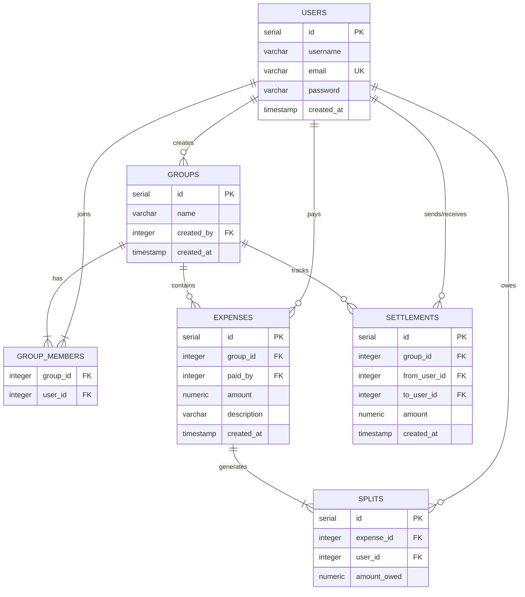

# Expense Splitter (Full-Stack Ledger & Debt Simplifier)

A full-stack, responsive web application inspired by Splitwise that allows users to create groups, log shared expenses, calculate real-time net balances, and settle debts. It features a custom **greedy two-pointer debt simplification algorithm** to minimize the number of overall repayment transactions.

---

## 🚀 Key Features

* **Secure Authentication**: User signups and logins utilizing JWT tokens and password hashing via `bcrypt`.
* **Dynamic Group Management**: Group creation, user invitation search (with debounced input lookup), and group member listing.
* **Atomic Expense Splitting**: Expenses are split equally among group members. The database write uses SQL Transactions to ensure data consistency.
* **Debt Simplification Algorithm**: Resolves $O(N^2)$ overlapping group debts into a maximum of $N-1$ transactions to simplify payments.
* **Centralized Error & Input Validation**: Integrated Zod validation schemas and Express rate limiters to prevent malformed data and server abuse.
* **Responsive Dashboard**: Beautiful interface styled using Tailwind CSS and Shadcn UI with light/dark theme support.

---

## 🛠️ Tech Stack

### Frontend
* **Core**: React (Vite), React Router
* **Styling**: Tailwind CSS, Shadcn UI primitives (`Button`, `Card`, `Input`)
* **API Handler**: Axios with request interceptors for automatic JWT transmission

### Backend
* **Core**: Node.js, Express, TypeScript
* **Database**: PostgreSQL (using `pg` driver with connection pooling)
* **Security & Validation**: JSON Web Tokens (JWT), BCrypt, Zod Schemas, Express-Rate-Limit

---

## 📊 Database Schema Design

The application utilizes a relational PostgreSQL database schema structured to maintain data integrity.



---

## 🧠 Core Algorithm: Debt Simplification

To prevent cases where User A owes User B ₹50, and User B owes User C ₹50 (which can be simplified to User A paying User C ₹50 directly), the application runs a **greedy two-pointer algorithm** inside the server:

1. **Calculate Net Balances**: Runs an optimized PostgreSQL CTE query to find every member's net balance: $\text{Total Paid} + \text{Settlements Sent} - (\text{Total Owed} + \text{Settlements Received})$.
2. **Categorize and Sort**: Users are split into two groups:
   * **Debtors** (net balance < 0)
   * **Creditors** (net balance > 0)
   * Both groups are sorted descending (largest debts and credits first).
3. **Pointers & Greedy Resolution**: Pointers iterate through both lists. The algorithm settles the minimum of the current debtor's debt and the creditor's credit, logs the transaction, updates their remaining balances, and moves the pointers once a balance hits zero.
4. **Outcome**: The maximum number of transactions is reduced from a worst-case $N(N-1)/2$ to at most $N-1$ transfers.

---

## ⚙️ Local Development Setup

### Prerequisites
* [Node.js](https://nodejs.org/) (v18+)
* [PostgreSQL](https://www.postgresql.org/) (v14+)

### 1. Database Setup
Create a new PostgreSQL database and run the schema setup:
```sql
CREATE DATABASE expense_splitter;

-- Schema tables (Users, Groups, Members, Expenses, Splits, Settlements)
-- Check backend/src/db_scripts/ for creation details.
```

### 2. Backend Setup
1. Open a terminal and navigate to the `backend` folder:
   ```bash
   cd backend
   ```
2. Install dependencies:
   ```bash
   npm install
   ```
3. Create a `.env` file in the `backend` root and configure it:
   ```env
   PORT=3000
   DB_HOST=localhost
   DB_PORT=5432
   DB_USER=your_postgres_user
   DB_PASSWORD=your_postgres_password
   DB_NAME=expense_splitter
   JWT_SECRET=your_jwt_secret_key
   ```
4. Start the backend development server:
   ```bash
   npm run dev
   ```

### 3. Frontend Setup
1. Open a new terminal and navigate to the `frontend` folder:
   ```bash
   cd frontend
   ```
2. Install dependencies:
   ```bash
   npm install
   ```
3. Start the Vite development server:
   ```bash
   npm run dev
   ```
4. Open your browser and navigate to the URL shown in your console (usually `http://localhost:5173`).

---

## 📈 What I Learned (Key Takeaways)

Building this project helped me transition from simple coding exercises to understanding production-level full-stack engineering challenges:

* **SQL Transactions & Pool Management**: Learned that executing independent SQL updates (like adding an expense and adding its split entries) is prone to partial failure. Implementing `BEGIN`, `COMMIT`, and `ROLLBACK` on pooled connection clients taught me how to ensure ACID properties in database management.
* **High-Performance SQL**: Replaced multiple API-driven database queries with a single query using **Common Table Expressions (CTEs)**. This consolidated client logic and taught me how to shift complex calculations to the database layer to reduce latency.
* **Keystroke Optimization (Debounce)**: Discovered how autocomplete search queries can flood backend systems. Implementing a 500ms debounce buffer on search inputs taught me practical ways to reduce server network load.
* **Type Safety & Schema Mapping**: Used **Zod** alongside TypeScript to enforce structural payload contracts, validating client inputs at the route layer and converting validation errors directly into user-friendly form fields.
